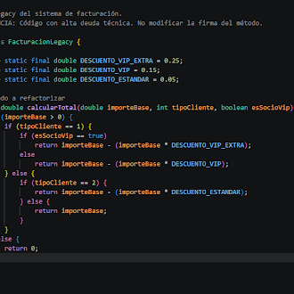
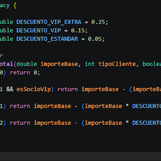

# AEE: "Limpieza de Primavera"

## 

**Asignatura:** Entorno de Desarrollo  
**Profesor:** [Willman Acosta Lugo](mailto:willman.acosta@eusa.es)  
**Alumnos:** Marcos Martinez Cossio, Daniel Ortiz Jimenez

## 

## 

## Fase 1: Análisis de la Deuda Técnica

1. **Verificación inicial.** Ejecuta los tests unitarios. Todo debe salir en verde. Esto os garantiza que el código original, por muy feo que sea, funciona.  
2. **Oler el código (*Code Smells*).** El Copiloto anotará en un bloc de notas los tres grandes problemas de este código:  
   * **Números mágicos.** ¿Qué significa 0.25 o 0.15? Son valores *hardcodeados* sin contexto. Si mañana el IVA o el descuento cambian, ¿dónde los buscamos?

Son valores que no se ven lo que significa en el código

* **Variables sin significado.** Nombres como cT, m, tC o dV no aportan ninguna semántica. Nos obligan a adivinar.

Esas variables no tienen explicación tampoco, no sabemos el significado de cada una

* **Código Spaghetti.** La anidación de múltiples if-else crea una estructura en forma de flecha \> que hace casi imposible seguir el flujo lógico de ejecución.

Esta implementación nos hace más complejo seguir el comportamiento del código

## Fase 2: Refactorización Asistida por el IDE (Quirófano abierto)

1. **Renombrado Seguro.** Utiliza **exclusivamente las herramientas automáticas del IDE** para cambiar los nombres de las variables en todo el documento a la vez, sin riesgo de errores tipográficos.  
   * *Sugerencia:* cT por calcularTotal, m por importeBase, tC por tipoCliente, dV por esSocioVip.

- Hemos cambiado todas las variables por el nombre de variable que pide la actividad seleccionando la variable, dandole click derecho+Rename Symbol, pones el nombre que pide y se cambia todas las variables que había que cambiar.

2. **Extracción de Constantes.** Selecciona los números mágicos (0.25, 0.15, etc.) y usa la herramienta de extracción del IDE para crear constantes private static final en la parte superior de la clase. Usa nombres autoexplicativos como DESCUENTO\_VIP o DESCUENTO\_ESTANDAR.  
- Ahora añadimos:

3. **Cláusulas de Guarda (*Guard Clauses*).** Modifica la estructura de control para "aplanar" el código. Invierte las condiciones lógicas y utiliza retornos tempranos (return) para eliminar **todos** los bloques “*else”*.  
   * *Ejemplo conceptual:* En lugar de if (importe \> 0\) { ... } else { return 0; }, cambiadlo a if (importe \<= 0\) return 0; en la primera línea.

- Para modificar la estructura de control, lo hemos aplanado dándole la vuelta a los if y quitando los else:

Fase 3: Verificación, Documentación y Entrega

1. **Validación constante**. Vuelve a ejecutar los tests unitarios tras CADA pequeño cambio. ¡Deben seguir en verde\! Si alguno falla, significa que habéis roto el negocio. Usad el control de versiones (Git) para deshacer los cambios y volver a un estado seguro.

\-No nos da ningún fallo

2. **Documentación profesional**. Genera la documentación JavaDoc escribiendo / y pulsando *Enter* justo encima del método. Rellena los campos @param explicando qué recibe la función y el @return detallando qué devuelve.  
3. **Guardado en el repositorio:** Realiza un *commit* semántico en vuestro repositorio que describa exactamente lo que habéis hecho.

*Ejemplo:* git commit \-m "refactor: reducción de complejidad ciclomática mediante cláusulas de guarda y nombrado semántico".

